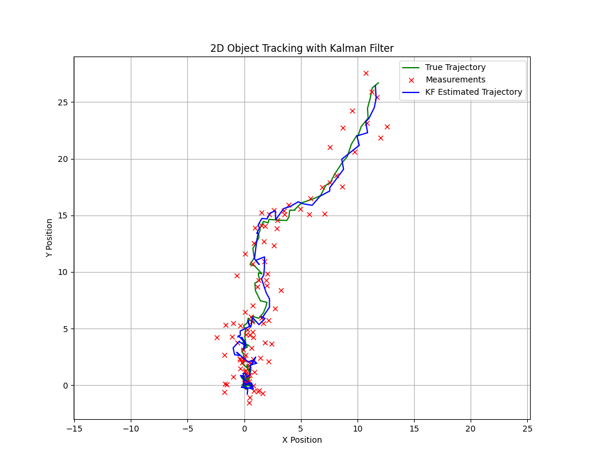

# multivariate-kalman-filter

This project involves tracking an object moving in two dimensions x and y. The velocities in x and y direction are assumed to be constant, so the object follows a constant velocity process model. Given the velocities, the object moves in the 2D space for `total_time`, which is currently set to 20 seconds. To simulate the motion, a process noise is added to the true state of the robot. To generate the measurements, a measurement noise is added to the true state of the robot. These two processes are handled in `simulate_motion()` and `generate_measurements()` functions in `main.py`. `main.py` is where the object's state variables, state transition function, etc are initialized. `multi_kf.py` implements the class `KalmanFilter`, including the predict and update steps. 

To run the project, simply run the script `main.py`. It will generate a plot similar to the following:

